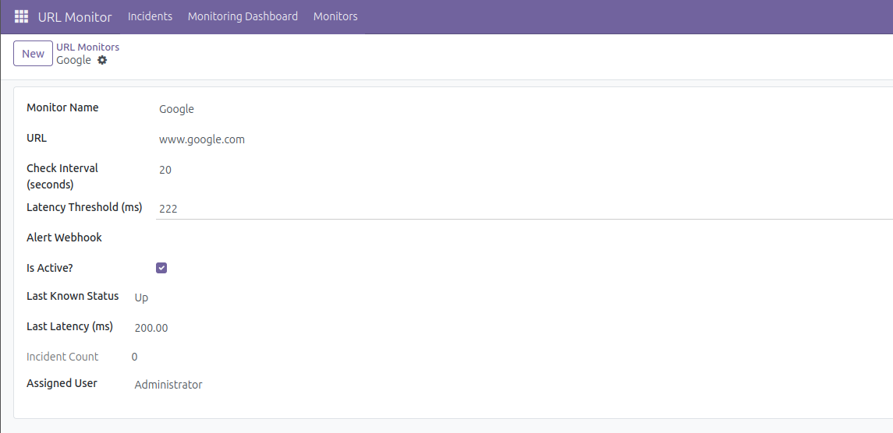
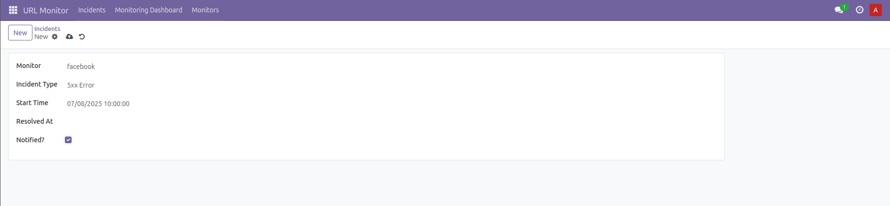

# 🌐 Odoo-FastAPI URL Monitoring Integration

This project integrates a FastAPI-based URL monitoring system with Odoo to enable seamless tracking of URL status, latency, incidents, and alerts from within the Odoo interface.

---

## 📌 Features

- ✅ Manage and sync URL monitors from FastAPI
- 📊 View real-time dashboard with uptime % and latency charts
- 🔁 Scheduled sync of monitor data and incidents (via cron jobs)
- ⚠️ Display and track historical incidents inside Odoo
- 🛠️ Manual “Sync Now” button support
- 🔔 Handle real-time alerts via webhook
- 👥 Role-based access control (Admin, Manager, User)

---

## 📦 Tech Stack

| Area        | Technology               |
|-------------|---------------------------|
| Backend     | Odoo (Python), FastAPI     |
| Frontend    | OWL (Odoo Web Library), QWeb |
| Scheduler   | Odoo Cron Jobs             |
| Webhooks    | Odoo Controllers           |
| Charts      | Chart.js (in Odoo Assets)  |
| Database    | PostgreSQL, SQLAlchemy     |

---

## 🧱 Module Structure

```plaintext
url_monitor_integration/
├── controllers/
│   └── dashboard_controller.py
├── models/
│   ├── url_monitor.py
│   └── url_incident.py
├── views/
│   ├── url_monitor_views.xml
│   ├── url_incident_views.xml
│   ├── dashboard_menu.xml
│   └── menu_root.xml
├── static/
│   └── src/
│       ├── js/
│       │   └── monitor_dashboard.js
│       └── xml/
│           └── monitor_dashboard.xml
├── security/
│   └── ir.model.access.csv
├── data/
│   └── cron_jobs.xml
├── __manifest__.py
└── README.md
````

---

## ⚙️ Setup Guide

### 1️⃣ Configuration

* Set system parameter:

  * Go to: `Settings → Technical → Parameters → System Parameters`
  * Add:

    * Key: `fastapi_base_url`
    * Value: `http://localhost:8000` (or your FastAPI server URL)

* Add your module path to the `addons_path` in `odoo.conf`

### 2️⃣ Install the Module

```bash
./odoo-bin -u url_monitor_integration -d db1
```

---

## 🔁 Data Sync

### 🔹 Cron Jobs

| Job Name       | Interval | Function Called                 |
| -------------- | -------- | ------------------------------- |
| Sync Monitors  | 5 min    | `sync_monitors_from_fastapi()`  |
| Sync Incidents | 5 min    | `sync_incidents_from_fastapi()` |

Defined in: `data/cron_jobs.xml`

### 🔹 Manual Sync

* A “Sync Now” button is available on both monitor and incident forms.
* Calls the same backend sync functions.

---

## 📊 Dashboard

* Custom OWL Component (`monitor_dashboard.js`)
* Uses `/monitor/dashboard/data` HTTP route from `dashboard_controller.py`
* Renders:

  * Total Monitors
  * Down Monitors
  * Uptime % in last 24h
* Assets declared in `__manifest__.py`

---

## 🛡️ Access Control

Defined in: `security/ir.model.access.csv`

| Group              | Permissions (CRUD) |
| ------------------ | ------------------ |
| base.group\_system | All (1,1,1,1)      |

You can extend it with Manager/User roles as needed.

---

## 📷 Screenshots

### 💻 Dashboard Example




> If the above images don’t load, try using raw GitHub links instead:
>
> ```markdown
> 
> 
> ```

---

## 👨‍💻 Author

**Shaket Shubham**
Module: `url_monitor_integration`
Version: `1.0`
GitHub: [shaketshubham](https://github.com/shaketshubham)

---

## ✅ Future Improvements

* [ ] Add per-user dashboard filtering
* [ ] Slack/MS Teams webhook notification support
* [ ] Pagination on incident list
* [ ] Public uptime pages for each monitor

---

